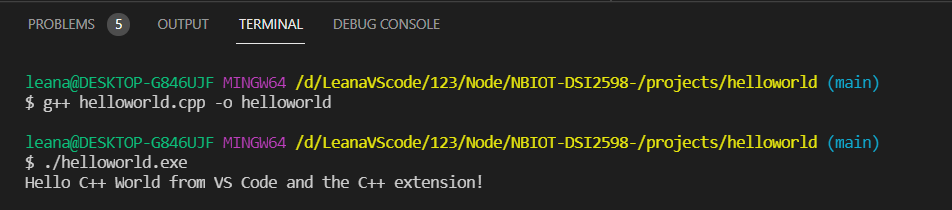

# NBIOT-DSI2598-

* 題目 : NBIOT於DSI2598+之腳踏車應用  
* 組員 : 陳淳、徐仁鴻、劉怡謙、張凱証、柯泓吉
* 指導老師 : 趙于翔 老師

* 軟體使用 : ARDUINO、NODE-RED、MySQL、ASP.NET
* 硬體使用 : DSI2598+、GPS模組、GY80模組、SIM卡、電池模組
* 作品說明 : 這是我們110年度製作的專題程式碼 (更詳細內容將補充在下方)
* 目前作品狀態 : 後續還會增加 此版本還會陸續更新

## 110-1 專題製作計畫表
週次 | 日期 | 內容
----|------|-------
w01 | 2021/09/16 | dsi2598＋環境測試
w02 | 2021/09/23 | gps模組之溝通
w03 | 2021/09/30 | sim卡之溝通
w04 | 2021/10/07 | GY-80之溝通
w05 | 2021/10/14 | 所有模組之整合
w06 | 2021/10/21 | 系統功能撰寫
w07 | 2021/10/28 | Demo影片錄製
w08 | 2021/11/04 | 專題期中報告週
w09 | 2021/11/11 | 期中考週
w10 | 2021/11/18 | 確定應用主題
w11 | 2021/11/25 | GPS接收準確數值
w12 | 2021/12/02 | 電池模組測試
w13 | 2021/12/09 | DSI2598+連接到電池模組
w14 | 2021/12/16 | NODE-RED設定/訂閱
w15 | 2021/12/23 | 雷切裝置雛形
w16 | 2021/12/30 | 專題報告週
w17 | 2022/01/06 | 考前複習週
w18 | 2022/01/13 | 期末考週

## 作品完整說明
1. TEST部分:  

2. 單元測試:  

3. 版本管理:  
### 版本變更紀錄
版本 | 日期 | 變更項目 | 審查日期
----|------|----------|---------
1.0 | 2021/09/13 | SIM卡測試 | 2021/09/18
1.1 | 2021/09/20 | GPS模組 | 2021/09/25
1.2 | 2021/09/27 | GY80模組數值轉換 | 2021/10/02
1.3 | 2021/10/04 | 所有晶片整合 | 2021/10/09
1.4 | 2021/10/11 | 裝置測試 | 2021/10/16
1.5 | 2021/10/18 | GPS接收準確數值 | 2021/10/23
2.1 | 2021/11/15 | 電池模組測試 | 2021/11/15
2.2 | 2021/11/22 | 第三端雲端伺服器架設EMQX | 2021/11/27
2.3 | 2021/11/29 | NODE-RED設定/訂閱 | 2021/12/04
2.4 | 2021/12/06 | 雷切裝置模型 | 2021/12/11
2.5 | 2021/12/13 | 完成資料同整 | 2021/12/18
2.6 | 2021/12/20 | 連接MySQL | 2021/12/25

4. 專案管理:  
主要會將專案放在github中(目前並無放置其他網頁上)  
主要管理者:陳淳
次要管理者:徐仁鴻、劉怡謙、張凱証、柯泓吉

5. 系統分析:  
  

6. 實作:  

在project資料夾裡面的資料是 軟體工程與演算法期末作業  

* helloworld 資料夾裡面  
因為arduino測試單元副檔名是.cpp 所以測試時 需要使用g++來看是否成功  
先編譯在執行  
`g++ helloworld.cpp -o helloworld`  
`./helloworld.exe`  

可以從圖片知道編譯成功  

7. 參考資料: 
https://github.com/Ultimaker/CppUnit  
 
  